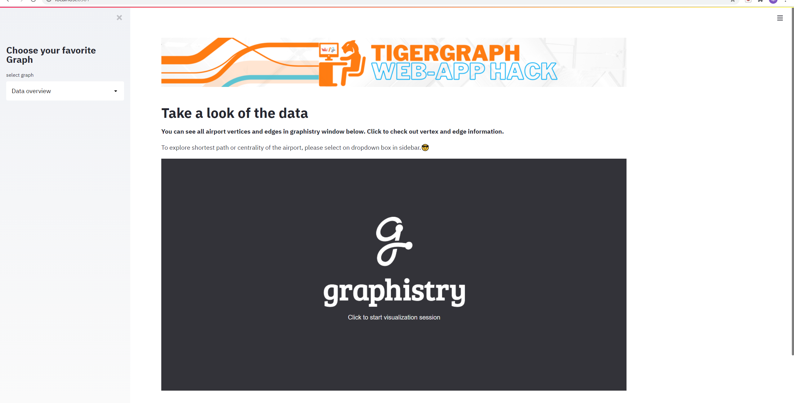
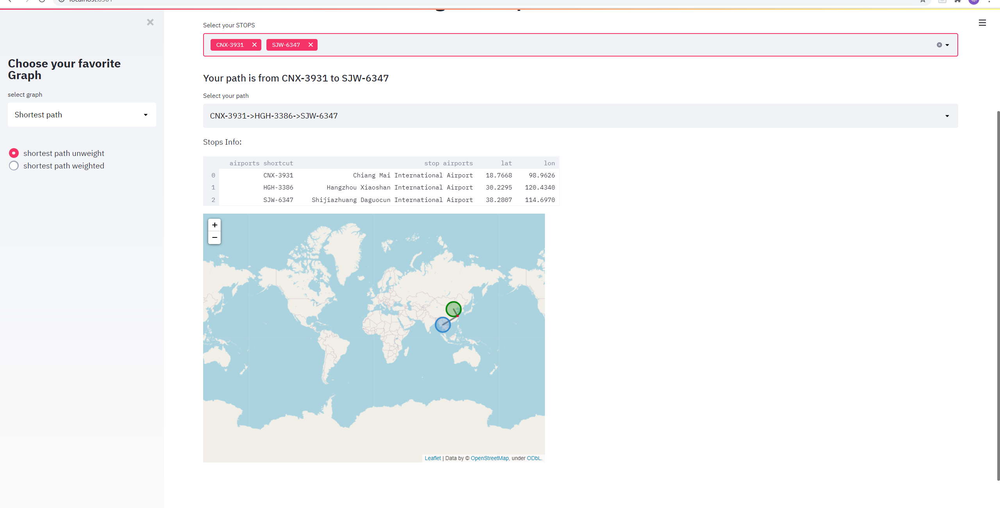
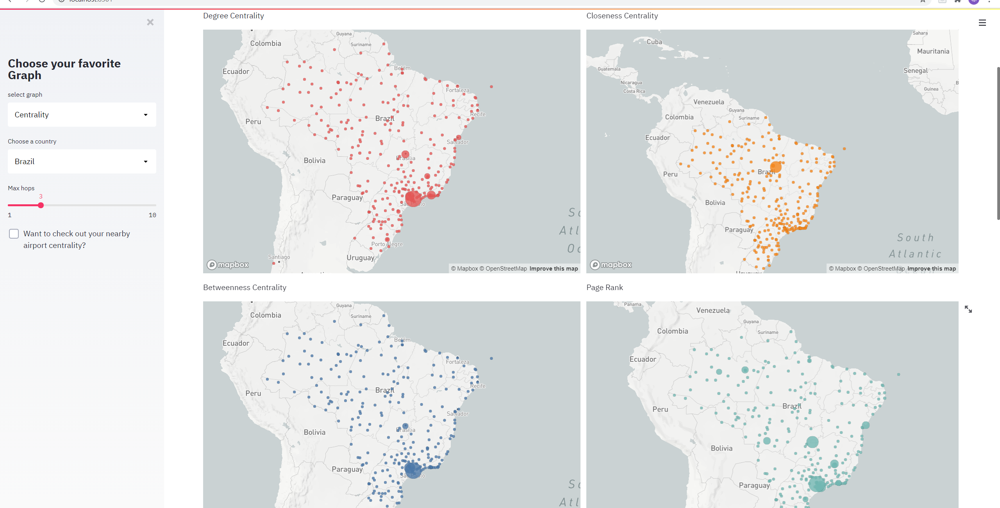

#TigerGraph-Streamlit web app hachathon
Background:
1. We always heard people waste too much time for buying plane ticket, because nobody want to waste time on the air. Thus, those thoughts casued our project, which can help people find the shortest comfortable and available path between two airplane stations.
2. Our project not only can help customers travel in more convinent ways, also can expand many online flight-ticket-selling Apps' rate of downloads. Those App will save money and time for applicate this function.

#Tools & libraries:
Database: TigerGraph
Frameworks: Streamlit, React
Data visualization: Graphisty, folium, pydeck, altair, google map api

#Running operation Description:
In this project, we use Graph Analytics - Centrality Algorithm v3 Start kit. 
To run this project, follow the steps below:
1. Clone this repo
2. Set up the Tigergraph database with queries:
    Need to create a solution on tgcloud with Graph Analytics - Centrality Algorithm v3 as Start kit. Then install all gsql queries under `/MyGraph_Queries to tgcloud graph
3. Set up runtime environment and launch the project:
    go to repo directory
    (1) install all requirement under repo directory:
        $pip install -r requirement.txt
        $streamlit run main.py
    (2) install react required package(open a new terminal):
        $cd frontend
        $npm install
        $npm run start
    (3) intall react-backend required package(open a new terminal):
        $cd react-backend
        $npm install
        $npm start

Project functions:
1. data overview: 
2. shortest path:
3. centrality:

#Snapshot:
main page

shortest path unweight page

shortest path weight page

centrality page

